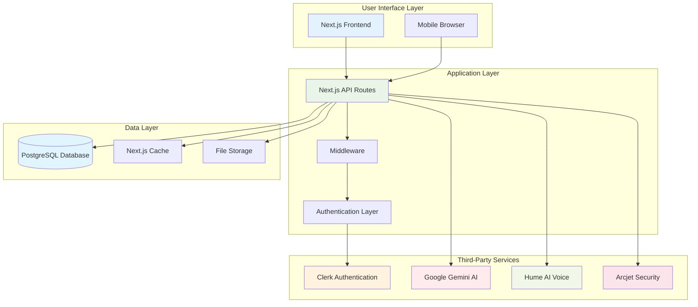
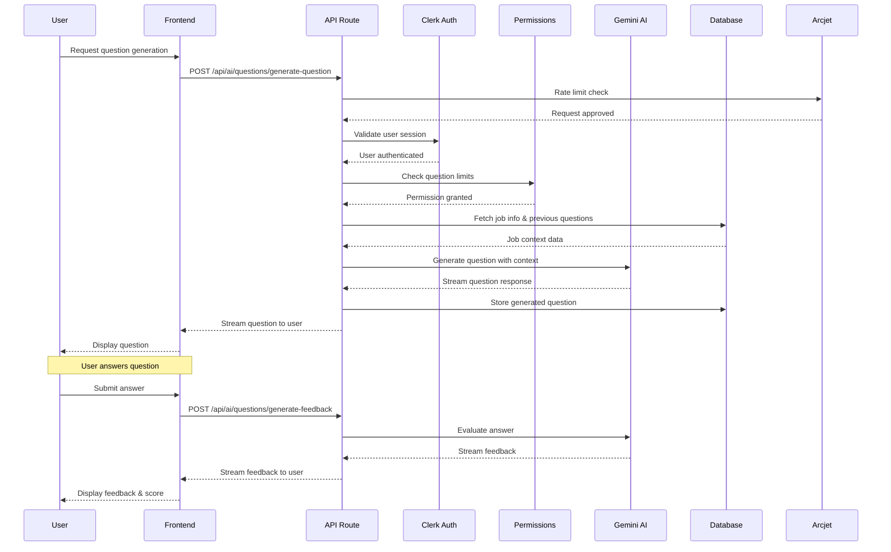
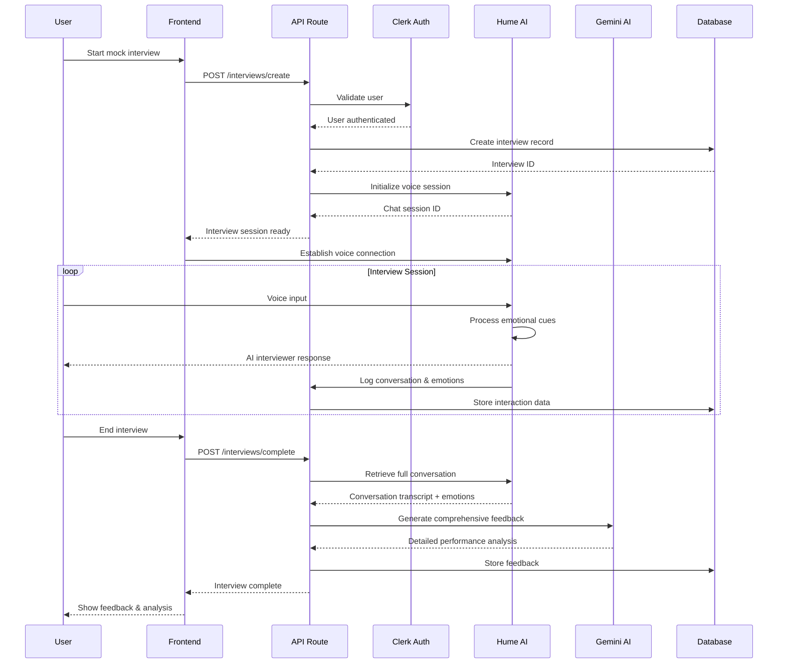
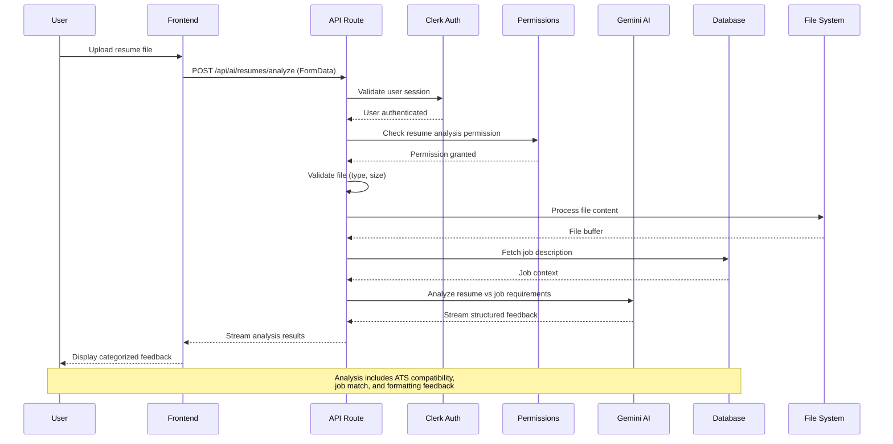
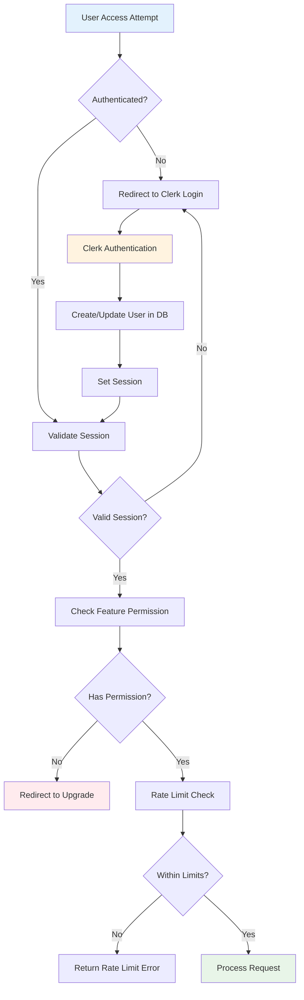
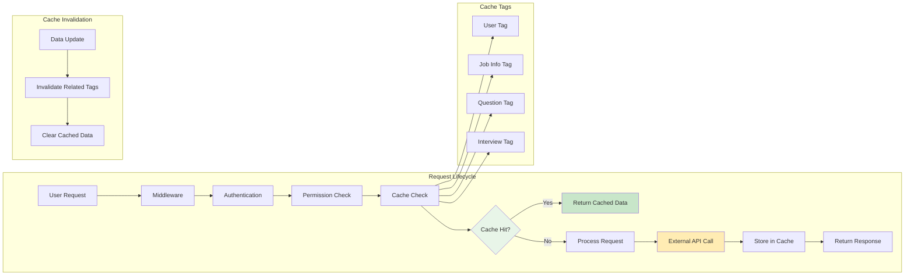
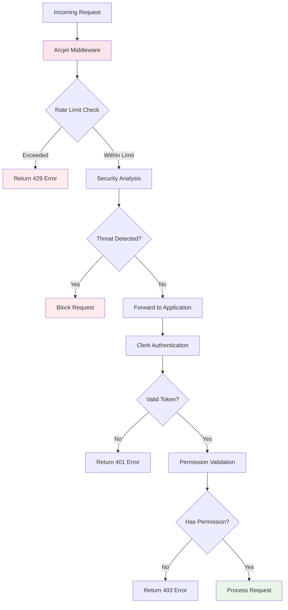
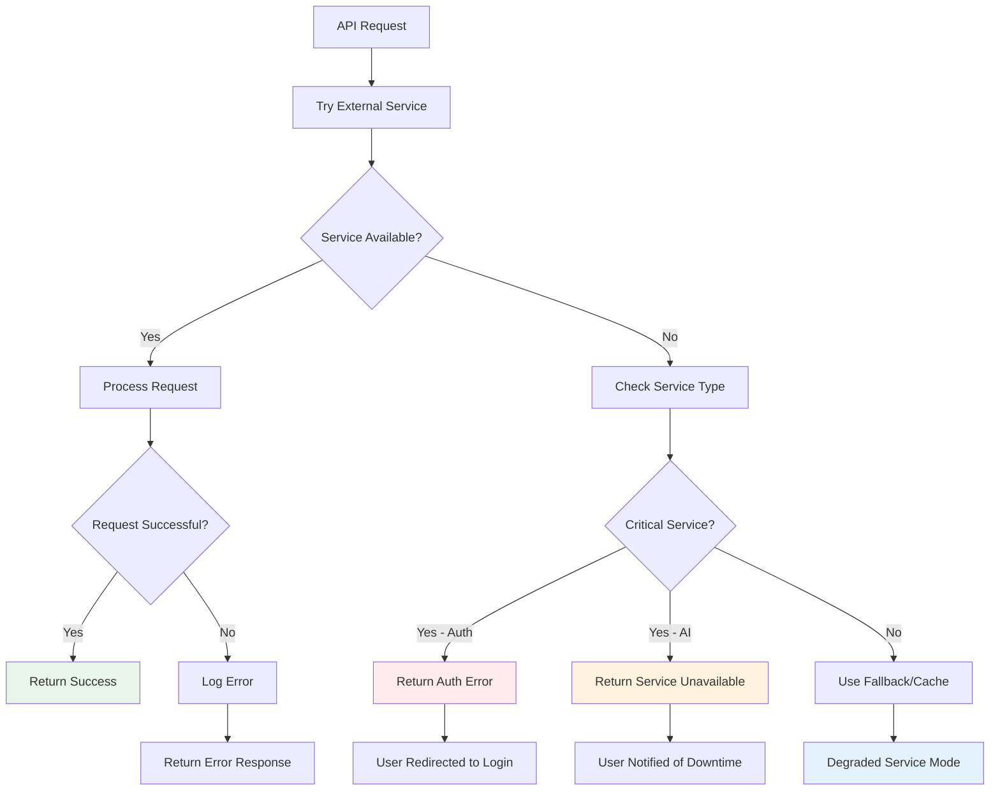
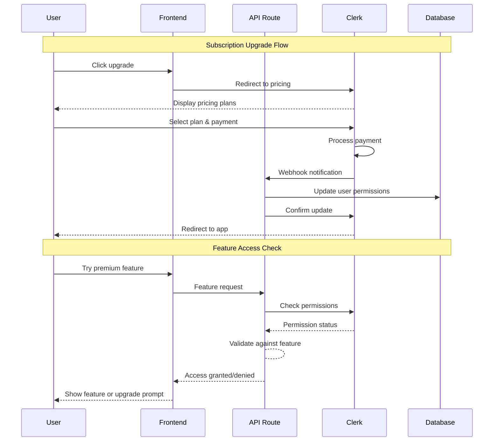
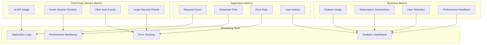

# Integration Workflow Diagrams

This document contains detailed workflow diagrams showing how the AI-Powered Job Preparation Platform integrates with various third-party services.

## Overall System Architecture

## Feature-Specific Integration Flows

### 1. Question Generation and Practice Flow

### 2. Mock Interview Flow with Hume AI

### 3. Resume Analysis Flow

### 4. Authentication and Permission Flow

### 5. Data Flow and Caching Strategy

## Security and Rate Limiting Flow

## Integration Error Handling

## Subscription Management Flow

---

## Integration Monitoring and Analytics

This integration workflow documentation provides a comprehensive view of how all the third-party services work together to deliver the AI-powered job preparation platform's functionality.