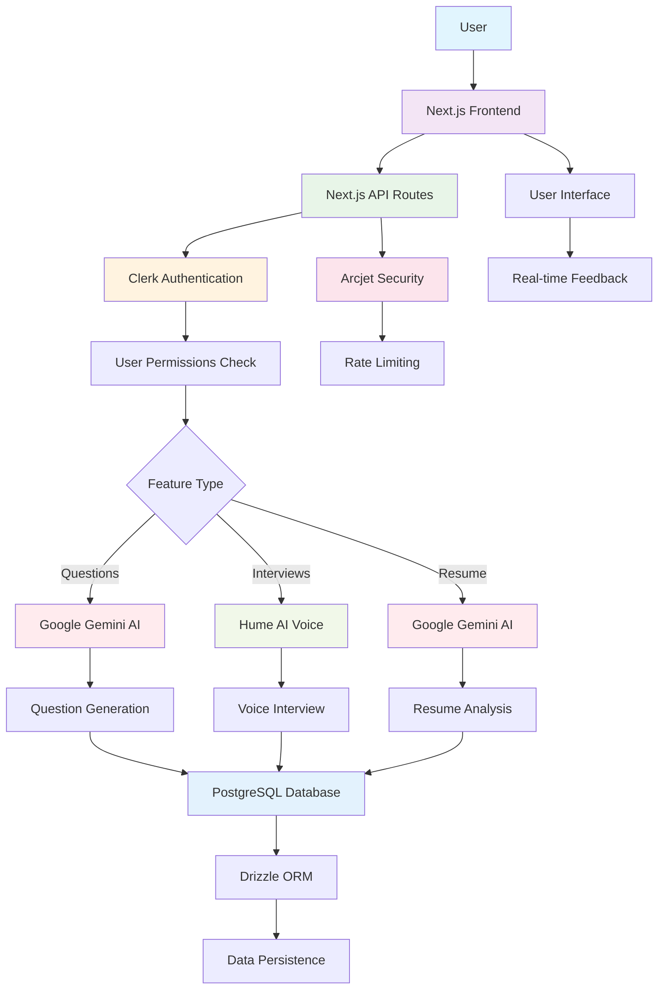

# Product Requirements Document (PRD)
# AI-Powered Job Preparation Platform

## Table of Contents
1. [Product Overview](#product-overview)
2. [Core Features](#core-features)
3. [User Journey & Workflows](#user-journey--workflows)
4. [Technical Architecture](#technical-architecture)
5. [Third-Party Integrations](#third-party-integrations)
6. [Subscription Model](#subscription-model)
7. [User Permissions & Security](#user-permissions--security)
8. [Integration Workflow Diagram](#integration-workflow-diagram)

---

## Product Overview

### Vision
To create an AI-powered comprehensive job preparation platform that helps job seekers practice interviews, improve their resumes, and prepare for technical questions tailored to specific job opportunities.

### Mission
Leverage cutting-edge AI technologies to provide personalized, interactive, and emotionally intelligent job preparation tools that increase candidate success rates.

### Target Audience
- Job seekers in technical fields
- Recent graduates preparing for their first job
- Professionals looking to switch careers or advance their positions
- Individuals seeking to improve their interview and resume skills

---

## Core Features

### 1. Job Information Management
**Purpose**: Central hub for managing job opportunities and descriptions

**Functionality**:
- Create and store job descriptions with detailed information
- Specify job titles, experience levels (Junior, Mid-level, Senior)
- Add comprehensive job descriptions that serve as the foundation for all AI-generated content
- Edit and update existing job information
- Organize multiple job opportunities in a dashboard view

**User Benefits**:
- Centralized management of multiple job applications
- Tailored preparation materials for each specific role
- Better organization of job search activities

### 2. AI-Powered Question Generation and Practice
**Purpose**: Generate and practice technical interview questions specific to job requirements

**Functionality**:
- **Question Generation**: AI creates questions based on job descriptions using Google Gemini AI
- **Difficulty Levels**: Three difficulty settings (Easy, Medium, Hard) to match user skill level
- **Question Diversity**: Tracks previous questions to avoid repetition and ensure variety
- **Answer Evaluation**: AI provides detailed feedback on user responses
- **Progressive Learning**: Questions become more targeted based on job requirements and user progress

**AI Integration**:
- Uses Google Gemini 2.5 Flash model for question generation
- Contextual understanding of job requirements
- Real-time streaming responses for immediate feedback

**User Benefits**:
- Job-specific preparation materials
- Immediate, detailed feedback on answers
- Progressive skill development
- Confidence building through practice

### 3. Mock Interview System with Emotional Intelligence
**Purpose**: Simulate realistic interview experiences with emotional awareness

**Functionality**:
- **Voice-Based Interviews**: Conduct full mock interviews using speech
- **Emotional Analysis**: Real-time analysis of emotional cues, tone, and speech patterns
- **Comprehensive Feedback**: Detailed evaluation covering:
  - Communication effectiveness
  - Confidence levels and nervous indicators
  - Response quality and relevance
  - Pacing and timing analysis
  - Engagement and interaction quality
- **Interview Recording**: Store interview sessions for later review
- **Performance Tracking**: Monitor improvement over multiple interview sessions

**AI Integration**:
- Hume AI Voice interface for natural conversation
- Emotional intelligence analysis during interviews
- Google Gemini AI for feedback generation and analysis

**User Benefits**:
- Realistic interview practice in a safe environment
- Emotional awareness and confidence building
- Detailed feedback on both content and delivery
- Reduced interview anxiety through preparation

### 4. Resume Analysis and Optimization
**Purpose**: Provide expert-level resume feedback tailored to specific job requirements

**Functionality**:
- **Multi-Format Support**: Accept PDF, Word documents, and text files (up to 10MB)
- **Job-Specific Analysis**: Compare resume against specific job descriptions
- **Comprehensive Evaluation**:
  - **ATS Compatibility**: Analysis of Applicant Tracking System requirements
  - **Job Match Assessment**: Skills, technologies, and experience alignment
  - **Writing and Formatting**: Grammar, clarity, structure, and professionalism
- **Actionable Recommendations**: Specific suggestions for improvement
- **Before/After Comparison**: Track resume improvements over time

**AI Integration**:
- Google Gemini AI for document analysis and feedback generation
- Structured analysis framework for consistent evaluations

**User Benefits**:
- Professional-quality resume feedback
- Increased chances of passing ATS systems
- Better alignment with job requirements
- Improved professional presentation

### 5. User Authentication and Account Management
**Purpose**: Secure user management with subscription-based access control

**Functionality**:
- **Secure Authentication**: Email-based registration and login
- **User Profiles**: Personal information and preferences management
- **Subscription Management**: Plan selection and billing integration
- **Usage Tracking**: Monitor feature usage against plan limits
- **Account Security**: Secure session management and data protection

**Integration**:
- Clerk authentication system for user management
- Subscription and billing integration

---

## User Journey & Workflows

### 1. New User Onboarding
1. **Registration**: User creates account via Clerk authentication
2. **Welcome Screen**: Introduction to platform features
3. **First Job Entry**: User creates their first job description
4. **Feature Discovery**: Guided tour of available preparation tools
5. **Plan Selection**: Choose subscription tier based on needs

### 2. Job Preparation Workflow
1. **Job Information Entry**: User inputs detailed job description
2. **Preparation Method Selection**: Choose from:
   - Technical Question Practice
   - Mock Interview Session
   - Resume Analysis
3. **AI-Powered Session**: Engage with chosen preparation method
4. **Feedback Review**: Analyze AI-generated insights and recommendations
5. **Iteration**: Repeat sessions to improve performance
6. **Progress Tracking**: Monitor improvements over time

### 3. Question Practice Workflow
1. **Difficulty Selection**: Choose appropriate challenge level
2. **Question Generation**: AI creates job-specific questions
3. **Answer Input**: User provides written or spoken responses
4. **AI Evaluation**: Receive detailed feedback and scoring
5. **Question History**: Review past questions and improvements
6. **Continuous Practice**: Generate new questions for ongoing preparation

### 4. Mock Interview Workflow
1. **Interview Initiation**: Start voice-based interview session
2. **Real-time Interaction**: Engage in natural conversation with AI
3. **Emotional Monitoring**: AI analyzes speech patterns and emotional cues
4. **Interview Completion**: Conclude session with performance summary
5. **Detailed Feedback**: Review comprehensive analysis of performance
6. **Performance Tracking**: Compare results with previous interviews

### 5. Resume Analysis Workflow
1. **File Upload**: Submit resume document (PDF, Word, or text)
2. **Job Matching**: Select target job description for analysis
3. **AI Processing**: Comprehensive evaluation against job requirements
4. **Feedback Review**: Analyze detailed recommendations
5. **Resume Revision**: Implement suggested improvements
6. **Re-analysis**: Upload revised resume for improvement verification

---

## Technical Architecture

### Frontend
- **Framework**: Next.js 15 with App Router
- **Language**: TypeScript for type safety
- **Styling**: Tailwind CSS for responsive design
- **UI Components**: Radix UI components for accessibility
- **State Management**: React hooks and server components

### Backend
- **Runtime**: Node.js with Next.js API routes
- **Database**: PostgreSQL for relational data storage
- **ORM**: Drizzle ORM for type-safe database operations
- **Caching**: Next.js caching with cache tags for optimization
- **File Handling**: Multi-format file upload and processing

### AI & Machine Learning
- **Primary AI**: Google Gemini 2.5 Flash for text generation and analysis
- **Voice AI**: Hume AI for emotional intelligence and voice interaction
- **AI SDK**: Vercel AI SDK for streaming responses and integration

### Security & Performance
- **Rate Limiting**: Arcjet for API protection and abuse prevention
- **Authentication**: Clerk for secure user management
- **Data Validation**: Zod for runtime type checking
- **Environment Management**: T3 ENV for configuration management

---

## Third-Party Integrations

### 1. Google Gemini AI
**Purpose**: Core AI functionality for content generation and analysis

**Integration Points**:
- Question generation based on job descriptions
- Answer evaluation and feedback
- Resume analysis and recommendations
- Interview feedback generation

**API Usage**:
- Streaming text generation for real-time responses
- Context-aware content creation
- Multi-modal analysis (text and document processing)

**Configuration**:
- API key authentication
- Rate limiting and usage monitoring
- Error handling and fallback mechanisms

### 2. Hume AI
**Purpose**: Emotional intelligence and voice interaction for mock interviews

**Integration Points**:
- Voice-based interview sessions
- Real-time emotional analysis
- Speech pattern evaluation
- Conversation flow management

**API Usage**:
- Voice interface for natural conversation
- Emotional feature extraction from speech
- Chat session management and storage

**Configuration**:
- API key and secret key authentication
- Real-time audio processing
- Emotional data collection and analysis

### 3. Clerk Authentication
**Purpose**: User authentication, authorization, and subscription management

**Integration Points**:
- User registration and login
- Session management
- Subscription tier enforcement
- Feature-based permissions

**API Usage**:
- Authentication webhooks
- User profile management
- Subscription status checking
- Permission validation

**Configuration**:
- Secret key authentication
- Webhook endpoint configuration
- Subscription plan definitions

### 4. Arcjet Security
**Purpose**: API security, rate limiting, and abuse prevention

**Integration Points**:
- Token bucket rate limiting
- Request filtering and validation
- User-based usage tracking
- Security threat detection

**API Usage**:
- Rate limiting per user
- Request analysis and filtering
- Usage analytics and monitoring

**Configuration**:
- API key authentication
- Rate limiting rules
- Security policy definitions

### 5. PostgreSQL Database
**Purpose**: Persistent data storage for user data and application state

**Integration Points**:
- User profile storage
- Job information persistence
- Question and interview history
- Usage tracking and analytics

**Schema Design**:
- Users table with profile information
- Job information with descriptions and metadata
- Questions with difficulty levels and timestamps
- Interviews with session data and feedback
- Relationships for data integrity

---

## Subscription Model

### Free Tier
**Limitations**:
- 5 technical questions per account
- 1 mock interview session
- No resume analysis access

**Features Included**:
- Basic job information management
- Limited question practice
- Single interview experience
- Basic feedback and insights

### Paid Tier (Unlimited)
**Permissions**:
- `unlimited_questions`: Unlimited technical question generation
- `unlimited_interviews`: Unlimited mock interview sessions
- `unlimited_resume_analysis`: Full resume analysis access

**Features Included**:
- All free tier features
- Unlimited access to all preparation tools
- Advanced feedback and analytics
- Progress tracking across sessions
- Priority support

### Permission System
The application uses a feature-based permission system with the following permissions:
- `unlimited_resume_analysis`: Full resume analysis access
- `unlimited_interviews`: Unlimited mock interviews
- `unlimited_questions`: Unlimited question generation
- `1_interview`: Single interview allowance (free tier)
- `5_questions`: Five question limit (free tier)

---

## User Permissions & Security

### Authentication Flow
1. **User Registration**: Secure account creation via Clerk
2. **Session Management**: Persistent login with secure token handling
3. **Permission Validation**: Feature access based on subscription tier
4. **Rate Limiting**: Protection against abuse via Arcjet

### Data Security
- **Encryption**: All sensitive data encrypted in transit and at rest
- **Access Control**: Role-based permissions for feature access
- **Data Privacy**: User data isolation and secure storage
- **Audit Logging**: Activity tracking for security monitoring

### API Security
- **Rate Limiting**: User-based request throttling
- **Input Validation**: Comprehensive request validation
- **Error Handling**: Secure error responses without data leakage
- **Authentication Required**: All API endpoints require valid authentication

---

## Integration Workflow Diagram



### Integration Flow Description

1. **User Interaction**: Users interact with the Next.js frontend application
2. **API Gateway**: Frontend communicates with Next.js API routes
3. **Authentication**: Clerk validates user identity and session
4. **Permission Check**: System verifies user's subscription tier and feature access
5. **Feature Routing**: Based on user action, requests are routed to appropriate AI services:
   - **Questions**: Google Gemini AI generates and evaluates questions
   - **Interviews**: Hume AI handles voice interaction and emotional analysis
   - **Resume**: Google Gemini AI analyzes resume content
6. **Security Layer**: Arcjet provides rate limiting and security monitoring
7. **Data Persistence**: All interactions and results stored in PostgreSQL via Drizzle ORM
8. **Real-time Feedback**: Streaming responses provide immediate user feedback

### Data Flow Patterns

#### Question Generation Flow
```
User Request → Clerk Auth → Permission Check → Gemini AI → Database Storage → User Feedback
```

#### Mock Interview Flow
```
User Voice → Hume AI Processing → Emotional Analysis → Gemini Feedback → Database Storage → Comprehensive Report
```

#### Resume Analysis Flow
```
File Upload → Validation → Gemini Analysis → Structured Feedback → Database Storage → Actionable Recommendations
```

---

## Future Roadmap Considerations

### Potential Enhancements
1. **Mobile Application**: Native iOS/Android apps for on-the-go preparation
2. **Video Interviews**: Addition of video-based mock interviews with facial expression analysis
3. **Industry Specialization**: Tailored preparation for specific industries (healthcare, finance, etc.)
4. **Peer Networking**: Connect users for peer-to-peer practice sessions
5. **Performance Analytics**: Advanced analytics dashboard for tracking progress
6. **Integration Marketplace**: Third-party integrations with job boards and recruiting platforms
7. **Collaborative Features**: Team preparation tools for group interview scenarios
8. **Multi-language Support**: Internationalization for global job markets

### Technical Improvements
1. **Offline Capabilities**: Local question practice when internet is unavailable
2. **Advanced AI Models**: Integration with newer, more powerful AI models
3. **Real-time Collaboration**: Live coaching sessions with human experts
4. **Performance Optimization**: Enhanced caching and response times
5. **Advanced Security**: Additional security layers and compliance certifications

---

*This PRD serves as a comprehensive guide to the AI-Powered Job Preparation Platform's current capabilities and integration architecture. It should be updated regularly as new features are added and integrations are enhanced.*